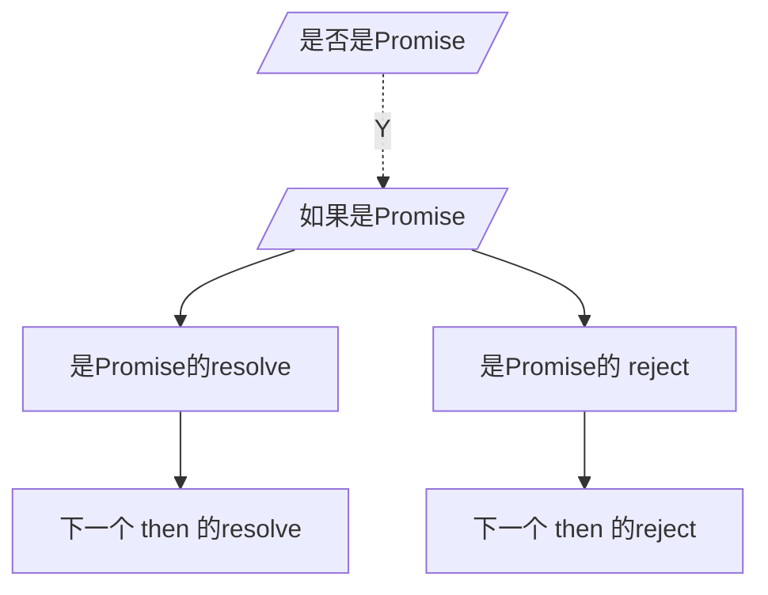

#  写一个  Promise 

[掘金](https://juejin.cn/post/7234447275861344293)
要实现的功能
 - [x]  同步调用
 - [x]  异步调用
 - [x]  then 链
 - [ ] 有趣

--- 
 then 链的功能
  如果 then 里面是一个 Promise 的话
    如果 是 resolve 下一个 then 里面的 成功
    如果是 reject 的话，下一个 走的是 then 里面的 失败
如果默认不写 then 的成功或者失败 函数
会直接传递给 下一个 then 的 失败或者成功